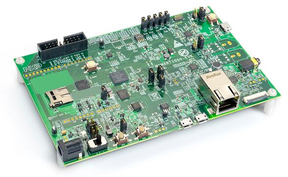
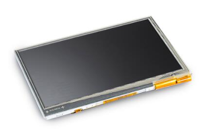

# PT_Demo_MIMXRT1050-EVK

   --       |  Description                              
 ---------- | ------------------------------
 Name       | PT_Demo_MIMXRT1050-EVK                                           
 Function   | Demo application of 2 protothread tasks: Task 1 controls the LEDs blinking; Task 2 print task infomation periodically                           
 Platform   | PT_Demo_MIMXRT1050-EVK                          
 MCU        | i.MX RT 1052                                     
 Type       | ARM Cortex-M7
 Frequency  | 600MHz
 RAM        | 512K bytes
 ROM        | 16M bytes
 peripheral | LED * 1
   --       | Button * 3

            
     
 
 
